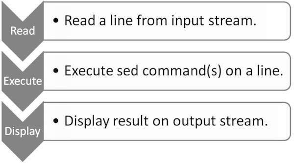

% RegEx and tools

<link id="linkstyle" rel='stylesheet' href='css/markdown.css'/>

[Regex manual](http://tool.oschina.net/uploads/apidocs/jquery/regexp.html)  
[Online Tools](https://regexr.com/)  
[Online Tools 101](https://regex101.com/)  
[Sed manual](https://www.gnu.org/software/sed/manual/sed.html)  
[Awk manual](https://www.gnu.org/software/gawk/manual/gawk.html)  
[Learn Regex the Easy way](https://github.com/ziishaned/learn-regex/blob/master/translations/README-cn.md)  


sed
===

Stream EDitor

Typical uses
------------

1. Text substitution
2. Selective printing of text files
3. In-a-place editing of text files
4. Non-interactive editing of text files

Workflow
--------



1. Read: SED reads a line from the input stream (file, pipe or stdin) and stores it in its internal buffer called *pattern buffer*.
2. Execute: All SED commands are applied sequentially on the *pattern buffer*. By default, SED commands are applied on all lines, unless line addressing is specified.
3. Display: Send the modified data to the output stream. After sending the data, the pattern buffer will be empty.
4. The above process repeats until the file exhausted.

* Pattern buffer is a private, in-memory, volatile storage area used by the SED.
* By default, all SED commands are applied on the pattern buffer, hence the input file remains unchanged. GNU SED provides a way to modify the input file in-a-place. We will explore about it in later sections.
* There is another memory area called **hold buffer** which is also private, in-memory, volatile storage area. Data can be stored in a hold buffer for later retrieval. At the end of each cycle, SED removes the contents of the pattern buffer but the contents of the hold buffer remains persistent between SED cycles. However SED commands cannot be directly executed on hold buffer, hence SED allows data movement between the hold buffer and the pattern buffer.
* Initially both pattern and hold buffer are empty.
* If no input file are provided, then SED accepts input from the standard input stream (stdin).
* If address range is not provided by default, then SED operates on each line.

Basic Syntax
------------

```
sed [-n] [-e] 'command(s)' files
sed [-n] -f scriptfile files
```

* examples
```
sed -e '1d' -e '2d' -e '5d' books.txt
```

```
echo -e "1d\n2d\n5d" > commands
sed -f commands books.txt
```

```
echo "p" > commands
sed -n -f commands quote.txt
```

* GNU specific options

| Option                             | Desciption                                                                                          |
|:-----------------------------------|:----------------------------------------------------------------------------------------------------|
| -n, --quiet, --silent              | Same as standard -n option                                                                          |
|                                    |                                                                                                     |
| -e script, --expression=script     |                                                                                                     |
|                                    |                                                                                                     |
| -f script-file, --file=script-file |                                                                                                     |
|                                    |                                                                                                     |
| --follow-symlinks                  | If this option is provided, the SED follows symbolic links while editing file in place              |
|                                    |                                                                                                     |
| -i[SUFFIX], --in-place[=SUFFIX]    | This option is used to edit file in place. If suffix is provided, it takes a backup of the original |
|                                    | file, otherwise it overwrites the original file.                                                    |
|                                    |                                                                                                     |
| -l N, --line-length=N              | This option sets the line length for I command to N characters.                                     |
|                                    |                                                                                                     |
| --posix                            | This option disables all GNU extensions.                                                            |
|                                    |                                                                                                     |
| -r, --regexp-extended              | This option allows to use extended regular expressions rather than basic regular expressions.       |
|                                    |                                                                                                     |
| -u, --unbuffered                   | When this option is provided, the SED loads minimal amount of data from the input files and flushes |
|                                    | the output buffers more often. It is useful for editing the output of "tail -f" when you do not     |
|                                    | want to wait for the output.                                                                        |
|                                    |                                                                                                     |
| -z, --null-data                    | By default, the SED separates each line by a new-line character. If NULL-data option is provided,   |
|                                    | it separates the lines by NULL characters.                                                          |

``` shell
1) A Storm of Swords, George R. R. Martin, 1216
2) The Two Towers, J. R. R. Tolkien, 352  
3) The Alchemist, Paulo Coelho, 197  
4) The Fellowship of the Ring, J. R. R. Tolkien, 432  
5) The Pilgrimage, Paulo Coelho, 288  
6) A Game of Thrones, George R. R. Martin, 864  
```

Loops
-----

A loop in SED works similar to a goto statement. SED can jump to the line marked by the label and continue executing the remaining commands. In  
SED, we can define a **label** as follows:

```
:label
:start
:ends
:up
```

To jump to a specific label, we can use the **b** command followed by the label name. If the label name is omitted, then the SED jumps to  
the end of the SED file. 
Let us write a simple 

``` shell
h;n;H;x
s/\n/, /
/Paulo/!b Print
s/^/- /
:Print
p' books.txt
```

Branches
--------

Branches can be created using the t command. The **t** command jumps to the label only if the previous substitue command was successfully.  
Let us take the same example as in the previous chapter, but instead of printing a single hyphen(-), now we print four hyphens. The following  
example illustrates the usage of the **t** command.

``` shell
sed -n '
h;n;H;x
s/\n/, /
:Loop
/Paulo/s/^/-/
/---/!t Loop
p' books.txt
'
```

Pattern Buffer
--------------

* prints the last line of the given file.
``` shell
sed -n '$ p' books.txt
```
There are two more operators that can be used to specify address range.

* \+ (plus operator)
  For instance, M, +n will print the next n lines starting from line number M.
  ``` shell
  sed -n '2,+4 p' books.txt
  ```
* ~ (tilde operator)
  It uses M~n form. It indicates that SED should start at line number M and process every n(th) line.

  ``` shell
  sed -n '1~2 p' books.txt
  ```

Pattern Range
-------------

``` shell
sed -n '/Paulo/ p' books.txt
sed -n '/Paulo/, 5 p' books.txt
sed -n '/The/, $ p' books.txt
sed -n '/Two/, /Pilgrimage/ p' books.txt
sed -n '/The/, +4 p' books.txt
```

Basic Commands
--------------

* Delete Command

``` shell
sed '4d' books.txt
sed '2,4d' books.txt
sed '/Paulo Coelho/d' books.txt
```

* Write Command

``` shell
sed -n 'w books.bak' books.txt
sed -n '2~2 w temp.txt' books.txt
sed -n -e '/Martin/ w Martin.txt' -e '/Paulo/ w Paulo.txt' -e '/Tolkien/ w Tolkien.txt' books.txt
```

* Append Command

``` shell
sed '$ a 7) Adultry, Paulo Coelho, 234' books.txt
sed '/The Alchemist/ a 7) Adultry, Paulo Coelho, 234' books.txt
```

* Change Command

``` shell
sed '3 c 3) Adultry, Paulo Coelho, 324' books.txt
sed '4, 6 c 4) Adultry, Paulo Coelho, 324' books.txt
```

* Insert Command

The insert command works much in the same way as append does. The only difference is that it inserts a line before a specific position.  
Given below is the syntax of the insert command:

``` shell
sed '4 i 7) Adultry, Paulo Coelho, 324' books.txt
```

* Translate Command

SED provides a command to translate characters and it is represented as **y**. It transforms the characters by position. Given below is the  
syntax of the translate command:

``` shell
echo "1 5 15 20" | sed 'y/151520/IVXVXX/'
```

``` shell
sed -e 'y/abcdefghijklmnopqrstuvwxyz/ABCDEFGHIJKLMNOPQRSTUVWXYZ' input.txt
```

* l Command
SED uses the l command to display hidden characters in the text.

``` shell
sed 's/ /\t/g w temp.txt' books.txt
sed -n 'l' temp.txt
```

Link other SED commands, it also accepts line numbers and patterns as an address.

``` shell
sed -n '2,5l' temp.txt
```

* Quit Command
Note that the quit command does not accept range of addresses, it only supports a single address. By default, SED follows read, execute, and  
repeat workflow; but when the quit command is encountered, it simply stops the current execution.

Belows command print the first 3 lines from the file.

``` shell
sed '3 q' books.txt
```

* Read Command

``` shell
echo "This is junk text." > junk.txt
sed '3 r junk.txt' books.txt
```

* Execute Command

We can execute external commands from SED using the **execute** command.  
It is represented by **e**. Given below is the syntax of the execute command.  

Let us illustrate the execute command with a simple example. The following  
SED command executes the UNIX **date** command before the third line.  

``` shell
sed '3 e date' books.txt
sed '/Paulo/ e date' books.txt
```

If you observe the syntax of the **e** command carefully, you will notice that **command** is optional.  
When no command is provided after **e**, it treats the contents of the pattern buffer as an external command. To  
illustrate this, let us create a commands.txt file with a few simple commands.  

``` shell
echo -e 'date\ncal\nuname' > commands.txt
sed 'e' commands.txt
```

* Miscellaneous Commands

By default, SED operates on single line, however it can operate on multiple lines as well. Multi-line commands are denoted by  
uppercase letters. For example, unlike the **n** command, the **N** command does not clear and print the pattern space.  
Instead, it adds a newline (\n) at the end of the current pattern space and appends the next line from the input-file to the  
current pattern space and continues with the SED's standard flow by executing the rest of the SED commands. Given below is the  
syntax of the **N** command.

Special Characters
------------------

SED provides two special characters which are treated as commands. This chapter illustrates the usage of these two special characters.  

* = Command

The "=" command deals with line numbers. Given below is the syntax of the "=" command.  
The "=" command writes the line number followed by its contents on the standard output stream. The following example illustrates this.  

``` shell
sed '=' books.txt
```

``` shell
sed '/Paulo/ =' books.txt
```

* & Command

SED supports the special character &. Whenever a pattern match succeeds, this special character stores the matches pattern. It is  
often used with the substitution command. Let us see how we can leverage this efficient feature.  

``` shell
sed 's/[[:digit:]]/Book number &/' books.txt
```

``` shell
sed 's/[[:digit:]]*$/Pages = &/' books.txt
```

Strings
-------

* Substitute Command

``` shell
sed 's/,/ | /g' books.txt
```

``` shell
sed '/The Pilgrimage/ s/,/ | /g' books.txt
```

In addition to this, SED can replace a specific occurrence of the pattern.  

``` shell
sed 's/,/ | /2' books.txt
```

SED provides an option to show only the cahnged lines. For this purpose, SED uses the **p** flag which refers to print.  

``` shell
sed -n 's/Paulo Coelho/PAULO COELHO/p' books.txt
```

We can store changed lines in another file as well. To achieve this result, use the **w** flag. The following example shows how to do it.

``` shell
sed -n 's/Paulo Coelho/PAULO COELHO/w junk.txt' books.txt
```

To perform case-insensitive substitution, use the i flag which implies ignore case. The following example performs case-insensitive substitution.

``` shell
sed -n 's/Paulo CoELHo/PAULO COELHO/pi' books.txt
```

So far, we have used only the foreslash(/) character as delimiter, but we can also use vertical bar(|), at sign(@), caret(^), exclamation mark(!) as a  
delimiter. The following example shows how to use other character as a delimiter.  

``` shell
echo "/bin/sed" | sed 's|/bin/sed|/home/jerry/src/sed/sed-4.2.2/sed|'
echo "/bin/sed" | sed 's@/bin/sed@/home/jerry/src/sed/sed-4.2.2/sed@'
```

Let us config the following text:

``` shell
echo "Three One Two"
```

Suppose we have to arrange it into a sequence. Means, it should print One first, then Two, and finally Three. The following one-liner does the needful.

``` shell
echo "Three One Two" | sed 's|\(\w\+\) \(\w\+\) \(\w\+\)|\2 \3 \1|'
```

* String Replacement Flags

\\L: When \\L is specified in the replacement string, it treats all the remaining characters of the word after \\L as lowercase characters.  

``` shell
sed -n 's/Paulo/PA\LULO/p' books.txt
```

\\u: When \\u is specified in the replacment string, it treats the immediate character after \\u as an uppercase character.  

``` shell
sed -n 's/Paulo/p\uaulo/p' books.txt
```

\\U: When \\U is specified in the replacemnt string, it treats all the remaining character of the word after \\U as uppercase characters.  

``` shell
sed -n 's/Paulo/\Upaulo/p' books.txt
```

\\E: This flag should be used with \\L or \\U. It stops the conversion initialed by the flag \\L or \\U.  

``` shell
sed -n 's/Paulo Coelho/\Upaulo \Ecoelho/p' books.txt
```

Managing Patterns
-----------------

Let us discuss the **n** command which print the pattern space. It will be used in the conjuction with other commands.  

``` shell
sed 'n' books.txt
```

The **n** command prints the content of the pattern buffer, clears the pattern buffer, fetches the next line into pattern buffer, and applies command on it.  

SED provides **x** command to exchange the contents of pattern and hold buffers.

The **h** command deals with the hold buffer. It copies data from the pattern buffer to the hold buffer. Existing data from the hold buffer gets overwritten.  
Note that the **h** command does not move data, it only copies data. Hence, the copied data remains as it is in the pattern buffer.  

``` shell
sed -n '/Paulo/!h;/Paulo/{x;p}' books1.txt
```

SED provides the **H** command which appends the content to the hold buffer by adding a new line at the end. The only difference between **h** and **H** command is, the former  
overwrite data from the hold buffer, while the later appends data to the hold buffer.  

``` shell
sed -n /'Paulo/!h; /Paulo/{H;x;p}' books1.txt
```

SED providers the **g** command which copies data from the hold buffer to the pattern buffer. While copying, existing data from the pattern space gets overwritten.  

``` shell
sed -n '/Paulo/!h; /Paulo/{p;g;p}' books1.txt
```

Similarly, we can append the contents of the hold buffe to the pattern buffer. SED providers the **G** command which appends the content s to the patrtern buffer   
by adding a new line at the end.  

``` shell
sed -n '/Paulo/!h; /Paulo/{G;p}' books1.txt
```

``` shell
sed -n '/Paulo/!h; /Paulo/{x;G;p}' books1.txt
```

### Regular Expressions ###

#### Standard Regular Expressions ####

* Start of line (^)
  In regular expressions terminology, the caret(^) symbol matches the start of a line.  

  ``` shell
  sed -n '/^The/ p' books1.txt
  ```

* End of Line ($)
  End of line is represented by the dollar($) symbol. The following example prints the lines that end with "Coelho".  

  ``` shell
  sed -n '/^Coelho$/ p' books1.txt
  ```

* Single Character (.)
  The Dot (.) matches any single character except the end of line character.  

  ``` shell
  echo -e "cat\nbar\nrat\nmat\nbatting\nrats\nmats" | sed -n '/^..t$/'
  ```

* Match Character Set ([])
  In regular expression terminology, a character set is represented by square brackets ([]). It is used to match only one out of several characters.  

  ``` shell
  echo -e "Call\nTall\nBall" | sed -n '/[CT]all/ p'
  ```

* Exclusive Set ([^])
  In exclusive set, the caret negates the set of characters in the square brackets. The following example prints only "Ball".

  ``` shell
  echo -e "Call\nTall\nBall" | sed -n '/[^CT]all/ p'
  ```

* Character Range ([-])
  When a character range is provided, the regular expression matches any character within the range specified in square brackets.  

  ``` shell
  echo -e "Call\nTall\nBall" | sed -n '/[C-Z]all/ p'
  ```

* Zero or One Occurrence (\?)
  In SED, the question mark (\?) matches zero or one occurrence of the preceding character.  

  ``` shell
  echo -e "Behaviour\nBehavior" | sed -n '/Behaviou\?r/ p'
  ```

* One or More Occurrence (\+)
  In SED, the plus symbol(\+) matches one or more occurrences of the preceding character.  

  ``` shell
  echo -e "111\n22\n123\n234\n456\n222" | sed -n '/2\+/ p'
  ```

* Zero or More Occurrence (*)
  Asterisks (*) matches the zero or more occurrence of the preceding character.  

  ``` shell
  echo -e "ca\ncat" | sed -n '/cat*/ p'
  ```
* Exactly N Occurrences {n}
  {n} matches exactly "n" occurrences of the preceding character.  

  ``` shell
  sed -n '/^[0-9]\{3\}$/ p' numbers.txt
  ```

* At least n Occurrences {n,}
  {n,} matches at least "n" occurrences of the preceding character.  

  ``` shell
  sed -n '/^[0-9]\{5,\}$ p' numbers.txt
  ```

* M to N Occurrence {m,n}
  {m,n} matches at least "m" and at most "n" occurrences of the preceding character.  

  ``` shell
  sed -n '/^[0-9]\{5,8\}$/ p' numbers.txt
  ```

* Pipe (|)
  In SED, the pipe character behaves like logical OR operation. It matches items from either side the pipe.  
  ``` shell
  echo -e "str1\nstr2\nstr3\nstr4" | sed -n '/str\(1\|3\)/ p'
  ```

### Escpaing Characters ###

* Escaping "\"

  ``` shell
  echo 'str1\str2' | sed -n '/\\/ p'
  ```

* Escaping "\n"

  ``` shell
  echo 'str1\nstr2' | sed -n '/\\n/ p'
  ```

* Escaping "\r"

  ``` shell
  echo 'str1\rstr2' | sed -n '/\\r/ p'
  ```

* Escaping "\dnnn"
  This matches a character whose decimal ASCII value is "nnn".  

  ``` shell
  echo -e "a\nb\nc" | sed -n '/\d97/ p'
  ```

* Escaping "\onnn"
  This matches a character whose octal ASCII value is "nnn".  

  ``` shell
  echo -e "a\nb\nc" | sed -n '/\o142/ p'
  ```

  This matches a character whose hexadecimal ASCII value is "nnn".  

  ``` shell
  echo -e "a\nb\nc" | sed -n '/\x63/ p'
  ```

### POSIX Classes of Regular Expressions ###

There are certain reserved words which have special meaning. These reserved words are referred  
to as POSIX classes of regular expression.  

* [:alnum:]
  It implies alphabetical and numeric character.  

  ``` shell
  echo -e "One\n123\n\t" | sed -n '/[[:alnum:]]/ p'
  ```

* [:alpha:]
  It implies alphabetical characters only.  

  ``` shell
  echo -e "One\n123\n\t" | sed -n '/[[:alpha:]]/ p'
  ```

* [:blank:]
  It implies blank character which can be either space or tab.  

  ``` shell
  echo -e "One\n123\n\t" | sed -n '/[[:space:]]/ p' | cat -vte
  ```
  Note that the "cat -vte" is used to show tab characters (^I)  

* [:digit:]
  It implies decimal numbers only.  

  ``` shell
  echo -e "abc\n123\n\t" | sed -n '/[[:digit:]]/ p'
  ```

* [:lower:]
  It implies lowercase letters only.  

  ``` shell
  echo -e "one\nTWO\n\t" | sed -n '/[[:lower:]]/ p'
  ```

* [:upper:]
  It implies uppercase letters only.  

  ``` shell
  echo -e "one\nTWO\n\t" | sed -n '/[[:upper:]]/ p'
  ```

* [:punct:]
  ``` shell
  echo -e "One,Two\nThree\nFour" | sed -n '/[[:punct:]]/ p'
  ```

* [:space:]
  It implies whitespace characters.  

  ``` shell
  echo -e "One\n123\f\t" | sed -n '/[[:space:]]/ p' | cat -vte
  ```

### Meta Characters ###

* Word Boundary (\b)
  In regular expression terminology, "\b" matches the word boundary.  

  ``` shell
  echo -e "these\nthe\nthey\nthen" | sed -n '/\bthe\b/ p'
  ```

* Non-Word Boundary (\B)
  In regular expression terminology, "\B" matches non-word boundary.  

  ``` shell
  echo -e "these\nthe\nthey" | sed -n '/the\B/ p'
  ```

* Single Whitespace (\s)
  In SED, "\s" implies single whitespace character.  

  ``` shell
  echo -e "Line\t1\nLine2" | sed -n '/Line\s/ p'
  ```

* Single Non-Whitespace (\S)
  In SED, "\S" implies single whitespace character.  

  ``` shell
  echo -e "Line\t1Line2" | sed -n '/Line\S/ p'
  ```

* Single Word Character (\w)
  In SED, "\w" implies single word character, i.e., alphabetical characters, digits, and underscore (_).  

  ``` shell
  echo -e "One\n123\n1_2\n&;#" | sed -n '/\w/ p'
  ```

* Single Non-Word Character (\W)
  In SED, "\W" implies single non-word character which is exactly opposite to "\w".  

  ``` shell
  echo -e "One\n123\n1_2\n&;#" | sed -n '/\W/ p'
  ```

* Begining of Pattern Space (\`)
  In SED, "\`" implies the beginning of the pattern space.  

  ``` shell
  echo -e "One\nTwo One" | sed -n '/\`One/ p'
  ```

Use Recipes
-----------

* Removing Empty Lines

  ``` shell
  echo -e "Line #1\n\n\nLine #2" | sed '/^$/d'
  ```

  ``` shell
  echo -e "Line #1\n\n\nLine #2" | sed -n '/^$/!p'
  ```

* Removing Commented Lines from a C++ Program

  ``` shell
  sed 's|//.*||g' hello.cpp
  ```

* Adding Comments Before Certain Lines

  ``` shell
  sed '3,5 s/^/#/' hello.sh
  ```

* Wc -l command
  The "wc -l" command counts the number of lines present in the file.  

  ``` shell
  sed -n '$ =' hello.sh
  ```

* Head Command
  By default, the head command prints the first 10 lines of the file.  

  ``` shell
  sed '10 q' books.txt
  ```

* Tail -1 Command
  The "tail -1" prints the last line of the file. The following syntax shows its simulation.

  ``` shell
  sed -n '$p' test.txt
  ```

* Dos2unix Command
  In DOS environment, a newline is represented by a combination of CR/LF characters.  
  The following simulation of "dos2unix" command converts a DOS newline character to  
  UNIX newline character. In GNU/Linux, this character is often treated as "^M" (Control M)   
  character.  

  ``` shell
  sed 's/^M$//' test.txt > new.txt   # Press "ctrl+v" followed "ctrl+m" to generate "^M" character.
  cat -vte new.txt
  ```

* Unix2dos command
  Similar to "dos2unix", there is "unix2dos" command which converts UNIX newline character  
  to DOS newline character. The following example shows simulation of the same.  

  ``` shell
  sed 's/$/\r/' test.txt  > new.txt 
  ```

* Cat -E command
  The "cat -ET" command shows the Dollar($) symbol at the end of each line and displays  
  the TAB characters as "^I". The following example shows the simulation of "cat -ET"   
  command using SED.  

  ``` shell
  sed -n 'l' test.txt | sed 'y/\\t/^I/'
  ```

* nl Command
  The "nl" command simply numbers the lines of files. The following SED script simulates  
  this behavior.  

  ``` shell
  sed = test.txt | sed 'N;s/\n/\t/'
  ```

* cp Command
  The "cp" command crates another copy of the file. The following SED script simulates this behavior.  

  ``` shell
  sed -n 'w dup.txt' data.txt
  ```

* Expand Command
  The "expand" command converts TAB characters to whitespaces.  

  ``` shell
  echo -e "One\tTwo\tThree" > test.txt
  expand test.txt > expand.txt
  sed 's/\t/     /g' test.txt > new.txt
  diff new.txt expand.txt
  echo $?
  ```
* Tee Command
  The "tee" command dumps the data to the standard output stream as well as file.   
  Given below is the simulation of the "tee" command.  

  ``` shell
  echo -e "Line #1\nLine #2" | tee test.txt
  ```
  
  ``` shell
  sed -n 'p; w new.txt' test.txt
  ```

* cat -s Command
  UNIX "cat -s" command suppresses repeated empty output lines. The following code  
  shows the simulation of "cat -s" command.  

  ``` shell
  echo -e "Line #1\n\n\n\nLine #2\n\n\nLine #3" > test.txt
  cat -s test.txt
  ```

  ``` shell
  sed '1s/^$//p;/./,/^$/!d' test.txt
  ```

* grep Command
  By default, the "grep" command prints a line when a pattern match succeeds.  

  ``` shell
  sed -n '/Line #1/p' test.txt
  ```

* grep -v Command
  By default, the "grep -v" command prints a line when a pattern match fails. 

  ``` shell
  sed -n '/Line #1/!p' test.txt
  ```

* tr Command
  The "tr" command translates characters. Given below is its simulation.  

  ``` shell
  echo "ABC" | tr "ABC" "abc" 
  ```

  ``` shell
  echo "ABC" | sed 'y/ABC/abc/'
  ```

awk
===

* Types of AWK
1. AWK - Original AWK from AT&T Laboratory  
2. NAWK - Newer and improved version of AWK from AT&T Laboratory  
3. GAWK It it GNU AWK. All GNU/Linux distribution ship GAWK. It is fully compatible with AWK and NAWK.  
* Typical Uses of AWK
1. Text processing
2. Producing formatted text reports
3. Performing arithmetica operations
4. Perfroming string operations, and many more

Workflow
--------


1. Read: AWK reads a line from the input stream (file, pipe, or stdin) and stores it in memory.  
2. Execute: All AWK commands are applied sequentially on the input. By default,  
3. Repeat: This process repeats until the file reaches its end.  

* Program Structure
  Let us now understand the program structure of AWK.
  1. BEGIN Block
     BEGIN {awk-commands}
  2. Body Block
     /pattern/ {awk-commands}
  3. END Block
     END {awk-commands}

``` shell
awk 'BEING{printf "Sr No\tName\tSub\tMarks\n"} {print}' marks.txt
```

``` shell
awk -f commands.awk marks.txt
```

| Options                 | Description                                                                                            |
|:------------------------|:-------------------------------------------------------------------------------------------------------|
| -v                      | This option assigns a value to a variable. It allows assignment before the program execution.          |
|                         |                                                                                                        |
| --dump-variables[=file] | It prints a sorted list of global variables and their final values to file.                            |
|                         | The default file is **awkvars.out**                                                                    |
|                         |                                                                                                        |
| --help                  | This option prints the help message on standard output                                                 |
|                         |                                                                                                        |
| --lint[=fatal]          | This option enables checking of non-portable or dubious constructs. When an argument **fatal**         |
|                         | is provided, it treats warning messages as errors.                                                     |
|                         |                                                                                                        |
| --posix                 | This options turns on strict POSIX compatibility, in which all common and gawk-specific extendsions    |
|                         | are disabled.                                                                                          |
|                         |                                                                                                        |
| --profile[=file]        | This option generates a pretty-printed version of the program in file. Default file is **awkprof.out** |
|                         |                                                                                                        |
| --traditional           | This option displays the version information of the AWK program                                        |
|                         |                                                                                                        |
| --version               | This options displays the version information of the AWK program                                       |

Basic Examples
--------------

* Printing Column or Field

  ``` shell
  awk '{print $3 "\t" $4}' marks.txt
  ```

* Printing All Lines
  By default, AWK prints all the lines that match pattern.  

  ``` shell
  awk '/a/ {print $0}' marks.txt
  ```

* Printing Columns by Pattern
  When a pattern match succeeds, AWK prints the entire record by default. But you can instruct AWK to print  
  only certain field.  

  ``` shell
  awk '/a/ {print $3 "\t" $4}' marks.txt
  ```

* Counting and Printing Matched Pattern

  ``` shell
  awk '/a/{++cnt} END {print "Count = ", cnt}' marks.txt
  ```

* Printing Lines with More than 18 Characters

  ``` shell
  awk 'length($0) > 18' marks.txt
  ```

Built-in Variables
------------------

### Standard AWK Variables ###

* ARGC
  It implies the number of arguments provided at the command line.  

  ``` shell
  awk 'BEGIN {print "Arguments = ", ARGC}' One Two Three Four
  ```

* ARGV
  It is an array that stores the command-line arguments. The array's valid index ranges from 0 to ARGC-1.  

  ``` shell
  awk 'BEGIN {
      for (i = 0; i < ARGC - 1; ++i) {
        printf "ARGV[%d] = %s\n", i, ARGV[i]
      }
  }' one two three four
  ```

* CONVFMT
  It represents the conversion format for numbers. Its default value is %.6g.  

  ``` shell
  awk 'BEGIN { print "Conversion Format =", CONVFMT}'
  ```

* ENVIRON
  It is associative array of environment vaiables.  

  ``` shell
  awk 'BEGIN { print ENVIRON["USER"]}'
  ```

* FILENAME
  It represents the current file name.  

  ``` shell
  awk 'END {print FILENAME}' marks.txt
  ```

* FS
  It represents the (input) field seperator and its default value is space. You can also change this  
  by using **-F** command line option.  

  ``` shell
  awk 'BEGIN {print "FS = " FS}' | cat -vte
  ```

* NF
  It represents the number of fields in the current record.  

  ``` shell
  echo -e "One Two\nOne Two Three\nOne Two Three Four" | awk 'NF > 2'
  ```

* NR
  It represents the number of the current record.  

  ``` shell
  echo -e "One Two\nOne Two Three\nOne Two Three Four" | awk 'NR < 3'
  ```

* FNR
  It is similar to NR, but relative to the current file. It is useful when AWK is operating on multiple  
  files. Value of FNR resets with new file.  

* OFMT
  It represents the output format number and its default value is **%.6g**.

  ``` shell
  awk 'BEGIN {print "OFMT = " OFMT}'
  ```

* OFS
  It represents the output field separator and its default value is space.  

  ``` shell
  awk 'BEGIN { print "OFS = " OFS}' | cat -vte
  ```

* ORS
  It represents the output record separator and its default value is newline.  

  ``` shell
  awk 'BEGIN { print "ORS = " ORS}' | cat -vte
  ```

* RLENGTH
  It represents the length of the string matches by **match** function. AWK's match function searches for  
  a given string in the input-string.  

  ``` shell
  awk 'BEGIN { if (match("One Two Three", "re")) { print RLENGTH } }'
  ```

* RS
  It represents (input) record separator and its default value is newline.  

  ``` shell
  awk 'BEGIN { print "RS = " RS}' | cat -vte
  ```

* RSTART
  It represents the first position in the string matched by **match** function.  

  ``` shell
  awk 'BEGIN { if (match("One Two Three", "Thre")) { print RSTART } }'
  ```

* SUBSEP
  It represents the separator character for array subscripts and its default value is \034.  

  ``` shell
  awk 'BEGIN { print "SUBSEP = " SUBSEP }' | cat -vte
  ```

* $0
  It represents the entire input record.  

  ``` shell
  awk '{print $0}' marks.txt
  ```
  
* $n
  It represents the n-th field in the current record where the fields are separated by FS.  

  ``` shell
  awk '{ print $3 "\t" $4 }' marks.txt
  ```

### GNU AWK Specific Variable ###

* ARGIND
  It represents the index in ARGV of the current file being processed.  

  ``` shell
  awk 'BEGIN {
      print "ARGIND = ", ARGIND; print "Filename = ", ARGV[ARGIND]
  }' junk1 junk2 junk3
  ```

* BINMODE
  It is used specify binary mode for all file I/O on non-POSIX systems. Numeric values of 1, 2 or 3 specify that input files,  
  output files, or all files, respectively, should use binary I/O. String values of **r** or **w** specify that input files or  
  output files, respectively, should use binary I/O. String values of **rw** or **wr** specify that all files should use binary I/O.  

* ERRNO
  ``` shell
  awk 'BEGIN { ret = getline < "junkxxx.txt"; if (ret == -1) print "Error: ", ERRNO }'
  ```

* FIELDWIDTHS
  A space separated list of field widths variable is set, GAWK parses the input into fields of fixed width, instead of  
  using the value of the FS variable as the field separator.  

* IGNORECASE
  When this variable is set, GAWK becomes case-insensitive.  

  ``` shell
  awk 'BEGIN {IGNORECASE = 1} /amit/' marks.txt'
  ```

* LINT
  It provides dynamic control of the **--lint** option from the GAWK program. When this variable is set, GAWK prints lint warnings.  
  When assigned the string value fatal, lint warnings become fatal errors, exactly link **--lint=fatal**.

  ``` shell
  awk 'BEGIN {LINT = 1; a}'
  ```

* PROCINFO
  This is an associative array containing information about the process, such as real and effective UID numbers, process ID number, and so on.  

  ``` shell
  awk 'BEGIN { print PROCINFO["pid"] }'
  ```

* TEXTDOMAIN
  It represents the text domain of the AWK program. It is used to find the localized translations for the program's string.  

  ``` shell
  awk 'BEGIN { print TEXTDOMAIN }'
  ```

Operators
---------

| S.No | Desciption                        |
|:-----|:----------------------------------|
| 1    | Arithmetic Operators              |
| 2    | Increment and Decrement Operators |
| 3    | Assignment Operators              |
| 4    | Assignment Operators              |
| 5    | Relational Operators              |
| 6    | Logical Operators                 |
| 7    | Ternary Operators                 |
| 8    | Unary Operators                   |
| 9    | Exponential Operators             |
| 10   | String Operators                  |
| 11   | Regular Expression Operators      |

Regular Expressions
-------------------

* Dot
  It matches any single character exceptt the end of line character.  

  ``` 1c-enterprise
  echo -e "cat\nbat\nfun\nfin\nfan" | awk '/f.n/'
  ```

* Start of line
  It matches the start of line.  

  ``` shell
  echo -e "This\nThat\nThere\nTheir\nthese" | awk '/^The/'
  ```

* End of line
  It matches the end of line.  

  ``` shell
  echo -e "knofe\nknow\nfun\nfan\nnine" | awk '/n$/'
  ```

* Match character set
  It is used to match only one out of several characters.  

  ``` shell
  echo -e "Call\nTall\nBall" | awk '/[CT]all/'
  ```

* Exclusive set
  In exclusive set, the caret nagates the set of characters in the square brackets.  

  ``` shell
  echo -e "Call\nTall\nBall" | awk '/[^CT]all/'
  ```

* Alteration
  A verticall bar allows regular expressions to be logically ORed.  

  ``` shell
  echo -e "Call\nTall\nBall\nSmall\nShall" | awk '/Call|Ball/'
  ```

* Zero or One Occurrence
  It matches zero or one occurrence of the preceding character.  

  ``` shell
  echo -e "Colour\nColor" | awk /'Colou?r/'
  ```

* Zero or More Occurrence
  ``` shell
  echo -e "ca\ncat\ncatt" | awk '/cat*/'
  ```

* One or More Occurrence

  ``` shell
  echo -e "111\n22\n123\n234\n456\n222" | awk '/2+/'
  ```

* Grouping
  **Parenttheses ()** are used for grouping and the character \| is used for alternatives.  

  ``` shell
  echo -e "Apple Juice\nApple Pie\nApple Tart\nApple Cake" | awk '/Apple (Juice|Cake)/'
  ```

Arrays
------

AWK has associative arrays and one of the best thing about it is - the indexes need not to be continuous  
set of number; you can use either string or number as an array index. Also, there is no need to declare   
the size of an array in advance - arrays can expand/shrink at runtime.  

* Creating Array
  To gain more insige on array, let us create and access the elements of an array.  

  ``` shell
  awk 'BEGIN {
      fruits["mango"] = "yellow";
      fruits["orange"] = "orange";
      print fruits["orange"] "\n" fruits["mango"]
  }'

  ```

* Delete Array Elements
  For insertion, we used assignment operator. Similarly, we can use **delete** statement to remove an element from the array.  

  ``` shell
  awk 'BEGIN {
      fruits["mango"] = "yellow";
      fruits["orange"] = "orange";
      delete fruits["mango"];
      print fruits["mango"]
  }'
  ```

* Multi-Dimensional arrays
  AWK only supports one-dimensional arrays. But you can easily simulate a multi-dimensional array using the one-dimensional array itself.  

  ``` shell
  awk 'BEGIN {
      array["0,0"] = 100;
      array["0,1"] = 200;
      array["0,2"] = 300;
      array["1,0"] = 400;
      array["1,1"] = 500;
      array["1,2"] = 600;
      
      # print array elements
      print "array[0,0] = " array["0,0"];
      print "array[0,1] = " array["0,1"];
      print "array[0,2] = " array["0,2"];
      print "array[1,0] = " array["1,0"];
      print "array[1,1] = " array["1,1"];
      print "array[1,2] = " array["1,2"];
  }'
  ```

Control Flow
------------

* If statement

  ``` shell
  awk 'BEGIN {num = 10; if (num %2 == 0) printf "%d is even number.\n", num}'
  ```

* If Else statment

  ``` shell
  awk 'BEGIN {
      num = 11;
      if (num % 2 == 0) {
        printf "%d is even number.\n", num;
      } else {
        printf "%d is odd number.\n", num
      }
  }'
  ```

* If-Else-If Ladder

  ``` shell
  awk 'BEGIN {
  a = 30;
  if (a == 10) {
      print "a = 10";
  } else if (a == 20) {
      print "a = 20";
  } else if (a == 30) {
      print "a = 30";
  }
  }'
  ```

Loops
-----

* For Loop

  ``` shell
  awk 'BEGIN { for (i = 1; i <= 5; ++i) print i}'
  ```

* While Loop

  ``` shell
  awk 'BEGIN {i 1; while (i < 6) { print i; ++i } }'
  ```

* Do-While Loop

  ``` shell
  awk 'BEGIN {i = 1; do { print i; ++i } while (i < 10) }'
  ```

* Break Statement

  ``` shell
  awk 'BEGIN {
      sum = 0;
      for (i = 0; i < 20; i++) {
        sum += i;
        if (sum > 50)
            break;
        else
            print "Sum = ", sum
      }
  }'
  ```

* Continue Statement

  ``` shell
  awk 'BEGIN {
      for (i = 1; i <= 20; i++) {
        if (i % 2 == 0) 
            print i;
        else
            continue;
      }
  }'
  ```

* Exit Statement
  It is used to stop the execution of the script. It accepts an integer as an argument which is the exit status   
  code for AWK process. If no argument is supplied, **exit** returns status zero.  

  ``` shell
  awk 'BEGIN {
      sum = 0;
      for (i = 0; i < 20; i++) {
        sum += i;
        if (sum > 50) exit(10); else print "Sum = ", sum
      }
  }'
  ```

Built-in Functions
------------------

AWK has a number of functions built into it that are always available to the programmer.  
This chapter describes Arithmetic, String, Time, Bit manipulation, and other miscellaneous  
function with suitable examples.  

| S.No. | Desciption                 |
|:------|:---------------------------|
| 1     | Arithmetic Functions       |
| 2     | String Functions           |
| 3     | Time Functions             |
| 4     | Bit Manipulation Functions |
| 5     | Miscellaneous Functions    |

User Defined Functions
----------------------

``` awk
# Returns minimum number
function find_min(num1, num2){
   if (num1 < num2)
   return num1
   return num2
}
# Returns maximum number
function find_max(num1, num2){
   if (num1 > num2)
   return num1
   return num2
}
# Main function
function main(num1, num2){
   # Find minimum number
   result = find_min(10, 20)
   print "Minimum =", result
  
   # Find maximum number
   result = find_max(10, 20)
   print "Maximum =", result
}
# Script execution starts here
BEGIN {
   main(10, 20)
}
```

``` shell
awk -f funtions.awk
```

Output Redirection
------------------

* Redirection Operator
  ``` shell
  awk 'BEGIN { print "Hello, World !!!" > "/tmp/message.txt" }'
  ```

* Append Operator

  ``` shell
  awk 'BEGIN { print "Hello, World !!!" >> "/tmp/message.txt" }'
  ```

* Pipe
  It is possible to send output another program through a pipe instead of using a file.  
  This redirection opens a pipe to command, and writes the values of items through pipe to   
  another process to execute the command. The redirection argument command is actually an AWK expression.  
  
  ``` shell
  awk 'BEGIN { print "hello, world !!!" | "tr [a-z] [A-Z]" }'
  ```

* Two way communication
  AWK can communicate to an external process using **|&**, which is two-way communication.  
  
  ``` shell
  BEGIN {
      cmd = "tr [a-z] [A-Z]"
      print "hello world !!!" |& cmd
      close(cmd, "to")

      cmd |& getline outbuf
      print out;
      close(cmd);
  }
  ```

Pretty Printing
---------------

* Escape Sequences
  Similar to any string, format can caontain embedded escape sequences.  
  1. New Line
     ``` shell
     awk 'BEGIN { printf "Hello\nWorld\n" }'
     ```
  2. Horizontal Tab
    ``` shell
    awk 'BEGIN { printf "Sr No\tName\tSub\tMarks\n" }'
    ```
  3. Vertical Tab
      ``` shell
      awk 'BEGIN { printf "Sr No\vName\vSub\vMarks\n" }'
      ```
  4. Backspace
     ``` shell
     awk 'BEGIN { printf "Field 1\bField 2\bField 3\bField 4\n" }'
     ```
  5. Carriage Return
     ``` shell
     awk 'BEGIN { printf "Field 1\rField 2\rField 3\rField 4\n" }'
     ```
  6. Form Feed
     ``` shell
     awk 'BEGIN { printf "Sr No\fName\fSub\fMarks\n" }'
     ```
* Format Specifier
  1. %c
  2. %d and %i
  3. %e and %E
  4. %f
  5. %g and %G
  6. %o
  7. %u
  8. %x and %X
  9. %%

* Optional Parameters with %
  1. Width
  ``` shell
  awk 'BEGIN {
      num1 = 10; num2 = 20; printf "Num1 = %10d\nNum2 = %10d\n", num1, num2
  }'
  ```
  2. Leading Zeros
  ``` shell
  awk 'BEGIN {
      num1 = -10; num2 = 20; printf "Num1 = %05d\nNum2 = %05d\n", num1, num2
  }'
  ```
  3. Left Justification

  ``` shell
  awk 'BEGIN { num = 10; printf "Num = %-5d\n", num }' | cat -vte
  ```
  4. Prefix Sign
  ``` shell
  awk 'BEGIN {
      num1 = -10; num2 = 20; printf "Num1 = %+d\nNum2 = %+d\n", num1, num2
  }'
  ```
  5. Hash
  For %o, it supplies a leading zero. For %x and %X, it supplies a leading 0x or 0X respectively, only if the result is non-zero.  
  For %e, %E, %f, and %F, the result always contains a decimal point. For %g and %G, trailing zeros are not removed from the result.  

  ``` shell
  awk 'BEGIN {
      printf "Octal representation = %#o\nHexadecimal representation = %#X\n", 10, 10
  }'
  ```

-------------------------------------------------------------------------------

RegEx
=====

| Character    | Description |
|:-------------|-------------|
| \            |             |
| ^            |             |
| $            |             |
| *            |             |
| +            |             |
| ?            |             |
| {n}          |             |
| {n,}         |             |
| {n,m}        |             |
| ?            |             |
| .            |             |
| (pattern)    |             |
| (?:pattern)  |             |
| (?=pattern)  |             |
| (?!pattern)  |             |
| (?<=pattern) |             |
| (?<!pattern) |             |
| x\|y         |             |
| [xyz]        |             |
| [^xyz]       |             |
| [a-z]        |             |
| [^a-z]       |             |
| \\b          |             |
| \\B          |             |
| \\cx         |             |
| \\d          |             |
| \\D          |             |
| \\f          |             |
| \\n          |             |
| \\r          |             |
| \\s          |             |
| \\S          |             |
| \\t          |             |
| \\v          |             |
| \\w          |             |
| \\W          |             |
| \\xn         |             |
| \\num        |             |
| \\n          |             |
| \\nm         |             |
| \\nml        |             |
| \\un         |             |
