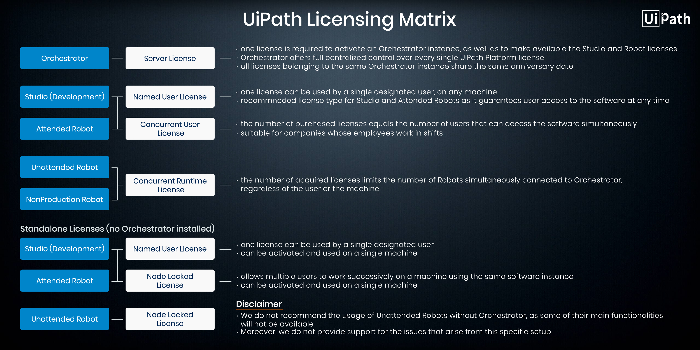

% UiPath Doc

<link id="linkstyle" rel="stylesheet" href="markdown.css"/>

# Intro #

## Main Types ##

* Sequences
  suitable to linear processes, enabling you to smoothly go from on activity to another, without cluttering 
  your project.

* Flowcharts
  suitable to a more complex business logic, enabling you to integrate decisions and connect activities in a more
  diverse manner, through multiple branching logic operators.

* State Machine
  suitable for very large projects. They use a finite number of states in their execution which are triggered by
  a condition or activity.

* Global Error

## Data Types ##

* GenericValue Variables
  The GenericValue variable is a type of variable that can store any kind of data, including text, numbers,
  dates, and arrays, and is particular to UiPath Studio.

# Recording #
* The recorders are a set of wizards that enable you to quickly create simple automations skeletons which you
  can later modify.
* There are four types of recorders: Basic, Desktop, Web and Citrix.
* There are two types of recording methods: step by step and automatic.

## Basic Recording ##
  * Basic and Desktop are almost identical in behavior, 
    + Recordable: Left Clicks on: buttons, checkboxes, dropdowns, etc
    + Non-Recordable: Keyboard shortcuts, Modifier keys, Right click, Mouse hover, etc
    + Manual-Recording: Keyboard shortcuts, Modifier keys, Right click, Mouse hover, etc
      Get Text, Find elements and images, Copy to clipboard.
  * Feature
    + Actions are self-contained
    + Simpler workflow
    - Can cause interference

## Desktop Recording ##
  * Feature
    + Actions are contained inside an AttachWindow component
    + No interference issue
    - More complex workflow

## Web Recording ##

## Citrix Recording ##
Citrix is for recording virtual machines, VNC, and of course Citrix environments.

# Advanced UI Interaction Introduction #

There are two types of User Interface interactions that can appear:
* Input: insert data into application, and Output reading data from an application.
* Ouput: reading data from an application.

In this module we will cover three main input methods:
* Hardware Events(default)
* Send Windows Messages
* Simulate(type/click)

and also three main output methods:
* FullText
* Native
* OCR

Things you will learn:
* How to set up the three Input methods and differences between them.
* How to use the Screen Scraping Wizard.
* How to set up the three Output methods and differences between them.
* How to use Data Scraping Wizard.

## Screen Scraping ##

### When to use screen scraping ###
* for bigger block text
* information behind complex UI
* you need exact word position on screen

## Data Scraping ##

## Selectors ##

### Full Selector ###
* Have top-level element.
* Basic Recorder uses full-selectors.

### Partial Selector ###
* Does not have top-level element.
* Desktop Recorder uses partial-selectors.

### wildcards ###

### AnchorBase Selector ###

### Relative Selector ###


## Image and Text automation ##

### Basic Citrix Automation ###

### Keyboard Automation ###

### Retrieve Infomation ###
* Scrape Relative
* 

## Excel and DataTables ##
* How to read from an Excel file using the Read Range Activity
* How to operate with a datatable
* How to filter a defined table in Excel
* How to use Append Range

### Activity ###

App -> Integration -> Excel
* Reading/Writing Excel file
* Iterate Excel file

#### Use Excel app/Direct access ####
* Requires MS Office Excel installed
* Multiple processes can use the same file
* Visible read-time changes

* Does not require MS Office Excel
* Only one process can use the file
* Works only for xlsex format

#### Tips ####

Notice that 'Add Headers' option.

## PDF ##

* NOTE: 打开"引用XObject对象模式"

* How to use 'Read PDF' Activity
* How to use 'Read PDF with OCR' Activity
* How to use anchors to get data from a field inside a PDF

### Extracting data from PDF ###
* 'Read PDF'
* 'Read PDF with OCR'
* 'Screen Scraping'

### Extracting a single piece of data ###

### Anchor base activity ###
* Use 'Find element' or 'Find Image' for anchor
* Use 'Get Text' to retrieve the data


## eMail Automation ##
* How to use the dedicated Email activities
* How to send and receive messages
* How to filter and download attachments from an email
* How to use message templates

## Debugging and Exception Handling ##
* How to use debug features
* How to sync with applications using Find Element or Element Exists
* How to trycatch activity works and how to use it 

### Timing and sync issue ###
* Element Exist
* Find Element
* Wait Element Vanish

## Project Orgnization ##

* How to use Invoke Workflow Activity
* How to orgnise your project in a clean and efficient way

### Aim ###

* Reliable
* Efficient
* Maintainable
* Extensible

### Best Practies ###

* Pick an appropriate layout for each workflow
* Break the whole process in smaller workflows
* Use exception handling
* Make your workflows readable
* Keep it clean

Reference To: RTF[^2]

-------------------------------------------------------------------------------

# Learn more about UiPath #

## Introduction ##

## About Licensing ##

## Ther User Interface ##

## Keyboard Shortcuts ##

## About Updating ##

## About Automation Projects ##

## Introduction to Automation Debugging ##

## Managing Activities Packages ##

## Reusing Automations Library ##

## Installing the Chrome Extension ##

## Installing the firefox Extension ##

## Connecting Your Project to a Source Control System ##

## Activities Guide ##

-------------------------------------------------------------------------------

# L1 UIPath fundamental #
* Studio
作为后台创建Process，并发布到Orchestrator上。
* Robot
分成两种不同的定义
    + Attanded Robot 一般用于人机互动的流程，手动触发。
    + Unattanded Robot 常封装于VM上，在Orchestrator上设置固定启动时间定点触发。

* Orchestrator
使用Studio开发完一个流程后，一般会将其发布到一个Orchestrator。

# workflow #

* Sequences
* Flowcart
* StateMahine

## 变量 ##

### 属性 ###

* Name
* Type
  + Boolean
  + Int32
  + String
  + Object
  + Generic Value 
    泛型
  + Array Of [T]
  + Browse for Types 
    类型库
* Scope
* Default

## 输入输出 ##

## Selector ##

#### Selector Editor####

### 通配符 ###

### UI Explorer ###

## Excel和数据表自动化 ##

### Excel类Activity ###
* Excel下的所有activities都必须包含在Excel application scope这个activity内才可以使用
* 默认会打开Excel进程，可以通过设置Visible属性选择不显示Excel文档。

### Workbook类Activity ###
* 在与Excel类文档相比中，推荐使用Workbook类Activity。因为不需要打开Excel进程。

### 基本操作 ###

* Read Cell, Write Cell
* Read Range, Write Range
* Read Column, Read Row
* Append Range

### 实例 ###

1. Read Range读取表格
2. Build Data Table根据需要创建一个数据表
3. For Each Row
4. Write Range

### Lookup Data Table ###

* Input
  + LookupValue
  可以通过Read Range读取，LookupValue是我们要查找的值，可以是常量也可以是变量
* Lookup Column
  + Column
  + ColumnIndex
  + ColumnName
* Output
  + RowIndex
  + CellValue
* Target Column
  Target Column是我们要查找的值在查找区域所在行对应的列，类似Lookup Column，对应列也可以通过一样的方法指定，这边就不赘述了。

## 键盘, 鼠标UI交互 ##

### Click, Double Click ###
目标可以通过 Indicate On Screen功能自动生成，该功能试图标识指定区域中的UI元素，并为其生成Selector(UiPath基础篇 - 初识Selector)。如果这对指定目标不起作用，则可能需要手动干预（UiPath基础篇 - Selector进阶1）。

### Hover ###
模拟鼠标在指定目标上悬停。

### Type into, Type Secure Text ###

### Send Hotkey ###

### Set Focus ###

## 文本自动化 ##

在某些特殊情况下，UI元素无法通过标准方法进行标识，这时候文本自动化相关的activity则能够根据它们包含的文本，去识别按钮、复选框和其它UI元素。

### Click Text, Hover Text ###

### Get Full Text ###

### Text Exist ###

### Extract Structured Data ###

## 图像自动化 ##

### Click Image, Hover Image ###

### Find Image ###

等待指定图像出现后再执行下一步activity。

### Image Exist ###

用于验证屏幕上是否存在某个指定图像。它会返回一个布尔变量，该变量声明是否找到了该图像。
和Find Image相似，能够根据给定的图像是否显示，或者通过将其用作Retry Scope activity的条件，为在循环中执行某些操作来做出决策。

### On Image Apprear ###

### On Image Vanish ###

## PDF ##

### Read PDF Text ###


-------------------------------------------------------------------------------

# L2 Orchestrator #

## Tutorial Outline ##

* How to deploy and trigger a process
  + Publishing a UiPath workflow
  + Creating an environment
* How to provision a Robot
* Further understanding of versioning
* Scheduling jobs
* How the job queue works, handling pending jobs, canceling and terminating jobs
  + The difference between canceling and terminating a job
* How to monitor all Robots registered to the Orchestrator through the log
  + How levels of error messages are communicated
* What are assets?
  + Storing variables in the Orchestrator
  + Specifying which robots will use which stored assets
  + Storing credentials in the Orchestrator
* Orchestrator queues
  + Using queues to work with lists of items that are handled by multiple Robots
  + Statuses of items in queues
  + How to add items to queues and how to get transaction items
  + How to track progress of transaction items
* Job input and output arguments

## Steps ##

### Publish a project ###

### Register your robot to Orchestrator ###
1. Add Machine
2. Create Robot
3. Connect Orchestrator from windows Robots settings

### Publishing your first process ###
1. Create a new Environment
2. Create a process

### Scheduling jobs ###

### Publishing the same process with new version ###

* If the robot instance is not connected to Orchestrator, the package has to be uploaded manually.
  1. Publish a package in Studio. The package is sent to a local folder.
  2. Goto the Packages section in Orchestrator and click on Upload. 
  3. Browse for the .nupkg file, which is saved in C:\ProgramData\UiPath\Packages by default.
  4. Click Upload to add the package to Orchestrator.

### Other ways to run a process ###

* Manually triggering a robot from the Assistant interface.
  1. Goto Robot Interface in the System Tray and click on the UI icon.
  2. Find the process, which should be available.
  3. Click the Play button next to the process.

### Schedules ###

'Stop Job after' and 'Disable Schdule at' from Actions tab.
The 'Stop Job after' property features the same the same two options - 'Stop & Kill'

### Assets and credentials practice ###

### Queues ###

Queues are very powerful tools in Orchestrator. They help you divide the work between multiple
robots, without having to keep track of complicated rules. As the name suggests, the transaction
items in a queue are processed in chronological order, with the exceptions mentioned in the
tutorial video.

To create a queue:
1. Under the 'Queues' section in Orchestrator, click the 'Add' button.
2. Click the 'Name' field and enter a name, such as 'Queue1'.
3. In the 'Max # of retries' section, type 3.

The create the first workflow, we will use an activity call 'Add Queue Item'.
1. Read the excel file as Data Table
2. Drag and drop an 'Add Queue Item' and place it in a 'For each row' activity.
3. The 'QueueName' field in the 'Properties' panel enables you to link this activity with a queue in
   Orchestrator.
4. The 'ItemInfomation' field is where the values of the transaction item can be added.

The second automation project features two relevant activities: 'Get transaction item' and 
'Set transaction status'. The first one requests an item from the queue. The second one notifies 
Orchestrator that a specific transaction item has been processed - successfully or not.
1. Create a new Sequence in Studio. Name it 'ProcessTransactions'.
2. 'Get Transaction Item' activity, fill in the 'QueueName' field by entering the previously created queue.

* Application Exception
  A transaction item that fails with an Application Exception is placed back in the queue and tried
  either at a later time or by a differenct Robot.

### Input and Output Arguments ###
Sets arguments at the scenirio:
1. Process -> Parameter
2. Jobs -> Parameter

-------------------------------------------------------------------------------
 
# L3 Advanced Training #

## Robotic Enterprise Framework ##

* Main state machine
* Exceptions handling
* State
  - Initstate (config file, InitAllApplications)
  - Get Transaction Data (TransactionItem, TransactionNumber)
  - Process Transaction
* SetTractionStatus
* GetAppCredential


-------------------------------------------------------------------------------

# Computer Vision #

Computer Vision is a feature that allows our Robots to 'see' the screen and visually identify all the elements,
ranther than relying on selector or images. It is an algorithm that enables human-like recognition os user
interfaces, using a mix of AI, OCR, text fuzzy-matching, and an anchoring system to tie it all together.

[AI Computer Vision Activity Pack](https://activities.uipath.com/docs/about-the-ai-computer-vision-activities-pack)

-------------------------------------------------------------------------------

# UiPath Studio 2018.4 Updates #

## Global Exception Hanlder ##

[Global Exception Handler](https://studio.uipath.com/docs/global-exception-handler#section-example-of-using-the-global-exception-handler)

## Citrix ##

[Citrix](https://studio.uipath.com/docs/about-native-citrix-automation)

## Save As Template ##

As the name states, it’s a Save As Template feature which allows you to save a Process or a Library as a template
that you can later re-use in your automation projects.

[Save As Template](https://studio.uipath.com/docs/project-templates)

## Repo Browser ##

[VCS](https://studio.uipath.com/docs/about-version-control)

## Process Libraries ##

### Steps ###

1. Creating Process Libraries

2. Importing Process Libraries

3. Customizing Process Libraries

4. Reusable Components

5. Making Private options

6. Libraries Publishing Errors

## Dark Theme ##

[Dark Theme](https://activities.uipath.com/docs/applying-themes-to-custom-activities)

# UiPath Orchestrator 2018.4 Updates #

## Webhooks ##

[Webhooks](https://orchestrator.uipath.com/docs/about-webhooks)
[Webhook.site](https://webhook.site/)

## Development Robot Decoupling ##

Two types of development robots
1. Standard Robots:
   - Installed along with Studio
   - Can be used on a single machine

2. Floating Robots:
   - Enable RPA developers to do their work seamlessly

-------------------------------------------------------------------------------

# UiPath 2019.4 Updates #

## UiPath 2019.4 Studio Updates ##

* Package Management Bundle
  - Libraries and Activities per Tenant
  - Mass Update Tool
  [Managing Activities](https://studio.uipath.com/docs/managing-activities-packages)

* GIT Integration & Workflow Diff
  [File Diff](https://studio.uipath.com/docs/using-file-diff#section-comparing-workflow-versions)

* SOAP and Swagger Libraries
  - What is it?
  Studio can now generate activies from **SOAP and Swagger** based REST services through the New Service
  wizard available for libraries. The service is added to the library's dependency tree and from there on,
  you can add activies to your library from the Activities panel.
  - Why do you need it?
  Instead of spending long hours of **constructing HTTP Requests**, you can incorporate this new, simple and
  extremely useful addition of Services to the Library projects, which can be integrated seemingly.
  As an example you can ease the process of creating new workflows, by simply loading services, turning them
  into activies and then feeding all necessary variables, instead of creating a long .json string, filled with
  quotes escaped by more quotes from scratch.

  [SOAP and Swagger](https://studio.uipath.com/docs/loading-web-services-in-libraries)

* Edit Settings

* Go!Marketplace Studio Integration

* Debugging in 2019.4

## UiPath 2019.4 Orchestrator Updates ##

* Real Time Monitoring
  Monitoring the state of your deployment by looking at jobs, queues or robots.

* Libraries and Activies per Tenant
  The **Libraries and Activities Per tenant** feature enables you to upload a reusable component (a library)
  and use it on a single tenant only, isolated from the others.

* Universal Blob Storage
  The **Universal Blob Storage** allows you to publish a set of generic storage API methods. By using this
  approach, the application services become agnostic of the native storage provider.
  + Storage
    Abstracts a key-value storage solution. The Storage Client API interface is compliant with the Object Storage
    cloud terminology. The API user should design the data with respect to a flat model (bucket like).
  + Storage Provider
    The underneath implementation of the persistence system, the storage wrapped by the Storage Client API interface.
  + Storage Bucket
    Bucket as it is described by the Object Storage concepts. By analogy with the traditional file systems, the bucket should be read as a disk volume.
  + Storage Content
    The actual data being persisted into the wrapped storage solution.
  + Storage Content Prefix
    The mechanism to logically group the saved content under a single bucket.
  + Storage Location
    It fully describes the location of the content inside the storage, that's the tuple (key, prefix, bucket).
    The key must be unique across the enclosing bucket.
  + Storage Transaction
    It's a best effort mechanism to address the all-or-nothing request for a set of storage commands.

* Encryption Key per Tenant
  The **Encryption Key per Tenant** feature allows for different tenants to use different encryption keys in
  order to protect/unprotect sensitive data.

* Orchestrator Mobile App
  tracking Robots, Jobs, Machines, Schedules.

* UiPath Recording
  

## UiPath 2019.4 Activities ##

* Intelligent OCR - Document Processing Framework
  [IntelligentOCR](https://activities.uipath.com/docs/about-the-intelligentocr-activities-pack)
  [Classify Document Scrope](https://activities.uipath.com/docs/classify-document-scope)
  [Keyword Based Classifier](https://activities.uipath.com/docs/keyword-based-classifier)
  [Train Classifiers And Extractors](https://activities.uipath.com/docs/train-classifiers-and-extractors)
  [Data Extraction Scope](https://activities.uipath.com/docs/data-extraction-scope)
  [Export Extraction Scope](https://activities.uipath.com/docs/export-extraction-results)
  [FlexiCapture Classifier](https://activities.uipath.com/docs/flexicapture-classifier)
  [FlexiCapture Extractor](https://activities.uipath.com/docs/flexicapture-extractor)

* Regex Builder
  + 'Matches' activity
  + 'IsMatch' activity
  + 'Replace' activity

* IBM Lotus Notes
  Usually integrated during the end of automation.

* PDF New Activities
  + Join PDF files
  + Manage PDF password

* Support for variables in 'Selectors'

* JxBrowser Support

* Edge Browser Support

## UiPath 2019.4 Driver ##

UiPath **Remote Desktop Protocol** support (RDP) offers the ability to **automate remote applications** through
a  Remote Desktop Connection.

[execute task in RDP](https://robot.uipath.com/docs/executing-tasks-in-a-minimized-rdp-window)

* Native Citrix Support

* Native RPD Support

* Better Browsing Support

* Citrix XenApp and XenDesktop
  [XenApp Automation](https://studio.uipath.com/docs/about-native-citrix-automation)


[^2]: (Rich Text Format) A document format from Microsoft for encoding text and graphics. It was adapted from IBM's DCA format and supports ANSI, IBM PC and Macintosh character sets. The RTF format is used as a source document for Windows Help files and other Microsoft products.

-------------------------------------------------------------------------------

# UiPath Licensing Model #

Orchestrator requires a server licensing.
Attented Robots and Studio require a Named User or Concurrent User license.
Unattended and NonProduction Robots require a Concurrent Runtime license.

## UiPath Licensing Matrix ##

<div align='center' width='100%'></div>

## Orchestrator Licensing ##

1. Getting Start

``` 1c-enterprise
regutil activate /email=xxx /code=xxx
regutil get-info 
regutil export-info /out_file=c:\orchestratorlicense.txt
```

2. Hosting Licensing

3. Tenant Licensing

## Robot Licensing ##
1. Standard Robot
2. Floating Robot

## License Management ##
1. Named User

2. Concurrent User

3. Concurrent Runtime


-------------------------------------------------------------------------------

## SAP Automation ##


-------------------------------------------------------------------------------

## Security Training ##

### 01. UiPath Ecosystem ###

### 02. Security Challenges ###

### 03. Studio Security ###

#### Version Control ####
1. Studio
   Use VCS to manipulate the version
2. Orchestrator
   NuGet

### 04. Robot Security ###

1. Orchestrator Credentials
   + centralized database, in which credentials are encrypted using AES 256-bit and stored on
     the SQL server database.
   + can be accessed by all connected robots.
   + should be configured with 'value per robot' to prevent unauthorized access.

2. Windows Credential Manager
   + works as a local machine storage
   + can also be used as a fallback in case Orchestrator is down and the robot does not require anything from
     Orchestrator except Credential Assets.


3. How can the sensitive data be protected.
   + Configuring a trusted channel: VPN connections, secure FTP sessions, HTTPS websites.
   + Data encryption, when using untrusted channels.
   + Usage of limited access environments, such as restricted shared folders or restricted SharePoint domains.

4. Isolation Environment
   + Development Environment
   + the RPA Developers and their robots interact only with systems that have sandbox environment.
   + the robots should NOT be able to connect to the UAT and production Orchestrator.

   + Production Environment
   + the robots permanently monitored for malicious tampering of package and the execution of correct version
     of the package.
   + access to the robots in Production restricted to trusted individuals.

### 05. Orchestrator Security ###
Orchestrator is built on three layers:
1. the **Presentation Layer** (accessed via browser)
2. the **Service Layer** (containing the business logic)
3. the **Persistence Layer** (containing the database where the events and relevant information are stored)

User Roles
1. Developer
   + default role for developers when logging on the platform.
   + the rights can vary from one environment to another: almost full access on the development environment, 
     view-only in UAT, limited (or non-existent) in production.
   + it is recommended to allow enough privileges in UAT so that the monitoring and bug fixing can be efficient.
2. Support
   + production only role, given to the support team that will have to monitor the processes running in the
     production environment.
   + should not allow package uploading or robot editing, as those should only be done by the administrator.
   + should allow starting and stopping jobs, viewing robots, schedules and logs.
3. Business
   + limited view rights in production (for traning purposed).
   + target audience: businiess department; they might be the one triggering the jobs and reviewing the queue 
     items that were processed.

Audit Trail

Robot Logging


-------------------------------------------------------------------------------

# UiPath Studio Shortcuts #

* File Management

| keybindings      | description                                                                |
|:-----------------|:---------------------------------------------------------------------------|
| Ctrl + Shift + N | Create a new **Blank Process**                                             |
| Ctrl + O         | Enables you to open a previously created workflow, either the **.xaml** or |
|                  | **project.json** file                                                      |
| Ctrl + L         | Opens the folder where the Log files are stored.                           |
| Ctrl + S         | Saves the currently opened workflow.                                       |
| Ctrl + Shift + S | Saves all the workflows that are currently open.                           |
| Ctrl + Tab       | Moves focus between workflows opened in the **Designer** panel.            |
|                  |                                                                            |

* Comment

| keybindings | description                                                                                     |
|:------------|:------------------------------------------------------------------------------------------------|
| Ctrl + D    | Ignores the activity that is currently selected by placing it into a **Comment Out** container. |
| Ctrl + E    | Removes the activity from the **Comment Out** container it was placed in.                       |
|             |                                                                                                 |

* Debugging

| keybindings | description                                                                    |
|:------------|:-------------------------------------------------------------------------------|
| F7          | Runs the currently opened workflow in debug mode.                              |
| F8          | Checks the currently opened workflow for validation errors.                    |
| F9          | Marks the selected activity with a breakpoint.                                 |
| Shift + F9  | Removes all the breakpoints in the currently opened workflow.                  |
| F11         | When debugging, enables you to step into a block of activites in the currently |
|             | selected workflow.                                                             |
| Shift + F11 |                                                                                |
|             |                                                                                |

* Recording

| keybindings    | description                                                                           |
|:---------------|:--------------------------------------------------------------------------------------|
| Alt + Ctrl + W | Opens the **Web Recording** toolbar.                                                  |
| Alt + Ctrl + B | Opens the **Basic Recording** toolbar.                                                |
| Alt + Ctrl + C | Opens the **Citrix Recording** toolbar                                                |
| Alt + Ctrl + D | Opens the **Desktop Recording** toolbar                                               |
| F2             | Adds delay during a recording activity.                                               |
| F3             | Lets you specify a custom recording region                                            |
| F4             | Lets you choose the UI Framework to record, which can be **Default, AA,** and **UIA** |
|                |                                                                                       |

* Workflow Execution

| keybindings | description                                                                 |
|:------------|:----------------------------------------------------------------------------|
| F5          | Runs the workflow that is currently open.                                    |
| Pause       | Pauses the execution of the current workflow, in both normal and debug mode. |
| F12         | Stops the execution of the current workflow, in both normal and debug mode.                                                                            |

* Selected Activity

| keybindings      | description                                                                        |
|:-----------------|:-----------------------------------------------------------------------------------|
| Ctrl + T         | Places the activity inside the **Try** section of a **Try Catch** activity         |
| Ctrl + N         | Creates a new **Sequence Diagram** in the current project                          |
| Ctrl + C         | Copies the selected activity or activities inside the selected item.               |
| Ctrl + V         | Pastes the copied activity or activities inside the selcted item.                  |
| Ctrl + K         | Creates an variable of the same type as the required type of the activity          |
| Ctrl + M         | Creates an **In** argument of the same type as the required type of the activity   |
| Ctrl + Shift + M | Creates an **Out** argument of the same type as the required type of the activity. |
| Ctrl + Space     | Opens the IntelliPrompt window                                                     |
|                  |                                                                                    |

* Miscellaneous

| keybindings    | description                                                                            |
|:---------------|:---------------------------------------------------------------------------------------|
| F1             | Enables you to access a help topic associated with the currently selected element      |
|                |                                                                                        |
| Ctrl + Alt + F | Sets the focus to the search box in the **Activities** panel to search for an activity |
| Ctrl + P       | Opens the **Manage Packages** windows                                                  |
| Esc            | Closes the **Publish, Manage Packages, File Diff** windows                             |
|                |                                                                                        |
